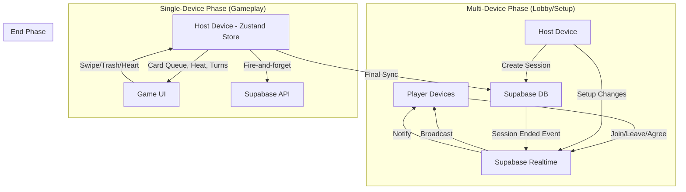
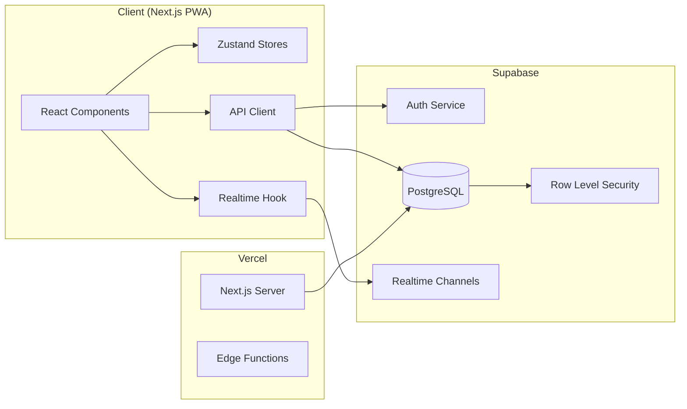

# Design Document: Core Game Loop

## Overview

This design covers Phase 1 of Tag.ai — the complete core game loop from user authentication through lobby creation, pre-game setup, card-draw gameplay, and session end. The architecture follows a **hybrid device model**: multi-device communication via Supabase Realtime during lobby/setup phases, and single-device local state (Zustand) during active gameplay where the phone is physically passed between players.

The system is built as a Next.js 14 PWA deployed on Vercel, with Supabase providing auth, PostgreSQL storage, and real-time WebSocket channels for lobby synchronization. During gameplay, the host device runs all game logic locally — card queue management, escalation engine calculations, and turn rotation — ensuring zero-latency card draws regardless of network conditions.

### Key Design Decisions

1. **Local-first gameplay**: Once a session starts, all card draws happen from a pre-built Zustand store on the host device. No network round-trips during active play.
2. **Fire-and-forget syncing**: Heart/trash actions queue API calls to Supabase but don't block gameplay. Failed syncs retry when connectivity returns.
3. **Pre-built card queue with buffer**: The queue is shuffled once at game start with a 20% buffer. Trashed cards are replaced from the buffer — no re-fetching.
4. **Pure escalation logic**: The heat calculation engine is a pure function (input → output) with no side effects, making it fully testable.
5. **Realtime only for lobby**: Supabase Realtime broadcasts are limited to lobby events (joins, leaves, setup changes, game start/end signals). No realtime during card draws.



## Architecture

### System Architecture



### State Architecture

The app uses a three-tier state model:

| Layer | Technology | Scope | Data |
|-------|-----------|-------|------|
| Server State | Supabase PostgreSQL | Persistent, cross-session | Users, sessions, cards library, trashed/saved cards |
| Realtime State | Supabase Realtime | Lobby duration only | Player joins/leaves, setup broadcasts, game start/end signals |
| Local Game State | Zustand | Active gameplay on host device | Card queue, heat level, turn rotation, cards played, consecutive skips |

### Routing Architecture

```
/src/app
  /(auth)
    /login/page.tsx              — Email + Google login
    /signup/page.tsx             — Registration flow
    /setup/page.tsx              — Username + avatar (first-time only)
    /auth/callback/route.ts      — OAuth callback handler
  /(main)
    /page.tsx                    — Home screen (host/join CTAs, coin balance)
    /profile/page.tsx            — User profile, stats, saved cards
  /game
    /[roomCode]
      /page.tsx                  — Main game page (lobby → setup → play → end)
      /join/page.tsx             — Join via room code entry
```

The game page (`/game/[roomCode]/page.tsx`) manages four internal phases via local state:
1. **Lobby** — realtime player list, room code display
2. **Setup** — host configures card count, filters, mode, drink rules
3. **Play** — card draw loop with swipe/trash/heart interactions
4. **End** — results screen with session stats

## Components and Interfaces

### Core Library Functions

#### Card Queue Builder (`/src/lib/game/card-queue-builder.ts`)

```typescript
interface CardQueueConfig {
  gameMode: GameMode;
  cardCountTarget: number;
  comfortFilters: string[];
  trashedCardIds: string[];  // current user's trashed cards
  playerCount: number;
}

interface QueuedCard {
  id: string;
  text: string;
  cardType: 'question' | 'action' | 'wild';
  intensity: number;       // 1-5
  category: CardCategory;
  wildCardType?: WildCardType;
  topics: string[];
}

interface CardQueue {
  cards: QueuedCard[];       // Main queue (card_count_target items)
  buffer: QueuedCard[];      // 20% extra for trash replacements
}

/**
 * Builds a shuffled card queue based on game configuration.
 * Pure function — no side effects, no network calls.
 * Requires the full card library to be passed in.
 */
function buildCardQueue(
  config: CardQueueConfig,
  cardLibrary: QueuedCard[]
): CardQueue;
```

#### Escalation Engine (`/src/lib/game/escalation-engine.ts`)

```typescript
type EscalationEvent =
  | 'dismiss'       // card swiped away normally
  | 'heart'         // card hearted
  | 'skip'          // card skipped (future — currently same as dismiss)
  | 'wild_card';    // wild card played

interface EscalationInput {
  currentHeat: number;           // 1.0 - 5.0
  event: EscalationEvent;
  consecutiveSkips: number;
  gameMode: GameMode;
}

interface EscalationOutput {
  newHeat: number;               // 1.0 - 5.0, clamped
}

/**
 * Pure function. Calculates new heat based on event.
 * Family mode caps at 2.0.
 * Heat is always clamped between 1.0 and 5.0.
 */
function calculateHeat(input: EscalationInput): EscalationOutput;

/**
 * Selects the next card from available pool based on current heat.
 * Weighted random: 60% current level, 30% adjacent, 10% distant.
 * Pure function given a seeded random.
 */
function selectCardByHeat(
  availableCards: QueuedCard[],
  currentHeat: number,
  random: () => number
): QueuedCard;
```

#### Turn Rotation (`/src/lib/game/turn-rotation.ts`)

```typescript
interface TurnState {
  players: { id: string; name: string; avatarUrl: string; turnOrder: number }[];
  currentIndex: number;
}

/**
 * Advances to the next player in rotation, wrapping around.
 */
function advanceTurn(state: TurnState): TurnState;

/**
 * Returns the current player.
 */
function getCurrentPlayer(state: TurnState): TurnState['players'][number];

/**
 * Returns the next player (for "Pass to..." prompt).
 */
function getNextPlayer(state: TurnState): TurnState['players'][number];
```

#### Wild Card Logic (`/src/lib/game/wild-cards.ts`)

```typescript
type WildCardType =
  | 'role_reversal'
  | 'pick_your_target'
  | 'everyone_answers'
  | 'shuffle'
  | 'heat_spike'
  | 'act_it_out'
  | 'whisper_round'
  | 'free_drink'
  | 'crown';

interface WildCardEffect {
  type: WildCardType;
  title: string;
  description: string;
  emoji: string;
  applyToQueue?: (queue: QueuedCard[], currentIndex: number) => QueuedCard[];
  heatModifier?: number;
  immunityCards?: number;
}

const WILD_CARD_DEFINITIONS: Record<WildCardType, WildCardEffect>;
```

#### Game Mode Configurations (`/src/lib/game/game-modes.ts`)

```typescript
type GameMode = 'icebreaker' | 'barkada' | 'lovers' | 'spicy' | 'chaos' | 'family';

interface GameModeConfig {
  name: string;
  emoji: string;
  description: string;
  audienceTag: string;
  entryHeat: number;
  poolDistribution: Record<number, number>;  // intensity level → percentage weight
  wildCardFrequency: { base: number; variance: number };
  maxHeat?: number;  // e.g., 2.0 for Family mode
}

const GAME_MODES: Record<GameMode, GameModeConfig>;
```

### Zustand Stores

#### Game Store (`/src/stores/game-store.ts`)

```typescript
interface GameState {
  // Queue state
  cardQueue: QueuedCard[];
  bufferCards: QueuedCard[];
  currentCardIndex: number;

  // Session metrics
  cardsPlayed: number;
  cardCountTarget: number;

  // Escalation
  heatLevel: number;
  consecutiveSkips: number;
  heatSpikeRemaining: number;   // cards remaining in heat spike
  preSpikeHeat: number;          // heat to revert to after spike

  // Turn management
  turnRotation: TurnState;
  crownImmunityRemaining: number;

  // UI state
  currentCardState: 'face_down' | 'revealed' | 'dismissing';
  showPassPrompt: boolean;
  sessionPhase: 'lobby' | 'setup' | 'play' | 'end';

  // Actions
  flipCard: () => void;
  dismissCard: () => void;
  trashCard: () => void;
  heartCard: () => void;
  advanceToNextCard: () => void;
  initializeQueue: (config: CardQueueConfig, library: QueuedCard[]) => void;
}
```

#### Session Store (`/src/stores/session-store.ts`)

```typescript
interface SessionState {
  // Session info
  sessionId: string | null;
  roomCode: string | null;
  hostId: string | null;
  status: 'lobby' | 'active' | 'ended';

  // Players
  players: SessionPlayer[];

  // Setup config
  cardCountTarget: number;
  gameMode: GameMode | null;
  comfortFilters: string[];
  drinkRuleTemplate: string | null;
  customDrinkRules: string[];
  nonDrinkingMode: boolean;

  // House rules
  agreedPlayers: string[];  // user IDs who tapped "I Agree"

  // Actions
  setSession: (session: Partial<SessionState>) => void;
  addPlayer: (player: SessionPlayer) => void;
  removePlayer: (userId: string) => void;
  setPlayerAgreed: (userId: string) => void;
}
```

### React Hooks

#### `useRealtimeLobby` (`/src/hooks/use-realtime-lobby.ts`)

```typescript
/**
 * Subscribes to Supabase Realtime channel for lobby events.
 * Handles: player_joined, player_removed, setup_changed, 
 *           rules_agreed, game_started, session_ended
 */
function useRealtimeLobby(roomCode: string): {
  isConnected: boolean;
  error: Error | null;
};
```

#### `useGameActions` (`/src/hooks/use-game-actions.ts`)

```typescript
/**
 * Provides card interaction handlers that update Zustand 
 * and fire-and-forget sync to Supabase.
 */
function useGameActions(): {
  flipCard: () => void;
  dismissCard: (direction: 'left' | 'right') => void;
  trashCard: (cardId: string, userId: string) => Promise<void>;
  heartCard: (cardId: string, userId: string) => Promise<void>;
};
```

### Key React Components

| Component | Location | Responsibility |
|-----------|----------|---------------|
| `CardFace` | `/src/components/game/CardFace.tsx` | Renders revealed card content (text, category pill, intensity dots) |
| `CardBack` | `/src/components/game/CardBack.tsx` | Face-down card with pattern, wild card variant with purple design |
| `CardStack` | `/src/components/game/CardStack.tsx` | Manages card stack visual (current + 2 behind at 96%/92% scale) |
| `SwipeHandler` | `/src/components/game/SwipeHandler.tsx` | Framer Motion drag/swipe gesture detection and animation |
| `TrashZone` | `/src/components/game/TrashZone.tsx` | Drag target that appears on hold, scales on hover |
| `HeartButton` | `/src/components/game/HeartButton.tsx` | Heart save button with fill state and animation |
| `HeatMeter` | `/src/components/game/HeatMeter.tsx` | Top bar heat gradient indicator |
| `TurnIndicator` | `/src/components/game/TurnIndicator.tsx` | Current player name/avatar in bottom bar |
| `PassPrompt` | `/src/components/game/PassPrompt.tsx` | "Pass to [name]" interstitial screen |
| `WildCardOverlay` | `/src/components/game/WildCardOverlay.tsx` | Full-screen wild card reveal with purple glow |
| `EndScreen` | `/src/components/game/EndScreen.tsx` | Session results: cards played, heat reached, play again CTA |
| `LobbyPlayerList` | `/src/components/lobby/LobbyPlayerList.tsx` | Real-time player list with kick buttons for host |
| `RoomCodeDisplay` | `/src/components/lobby/RoomCodeDisplay.tsx` | Large monospace room code + QR code + share button |
| `ComfortFilters` | `/src/components/setup/ComfortFilters.tsx` | Topic toggle list + custom filter input |
| `GameModeSelector` | `/src/components/setup/GameModeSelector.tsx` | 2-column grid of mode cards with glow selection |
| `HouseRules` | `/src/components/setup/HouseRules.tsx` | Rules display with per-player "I Agree" tracking |

## Data Models

### Database Schema (Supabase PostgreSQL)

```sql
-- Enum types
CREATE TYPE card_category AS ENUM (
  'hot_takes',
  'relationships',
  'memories',
  'confessions',
  'dares',
  'hypotheticals',
  'controversial',
  'roasts',
  'deep_philosophical'
);

CREATE TYPE card_type AS ENUM ('question', 'action', 'wild');
CREATE TYPE session_status AS ENUM ('lobby', 'active', 'ended');
CREATE TYPE game_mode_type AS ENUM ('icebreaker', 'barkada', 'lovers', 'spicy', 'chaos', 'family');

-- Users
CREATE TABLE users (
  id            uuid PRIMARY KEY DEFAULT gen_random_uuid(),
  email         text UNIQUE NOT NULL,
  username      text UNIQUE NOT NULL,
  avatar_url    text,
  coin_balance  integer DEFAULT 10,
  created_at    timestamptz DEFAULT now()
);

-- Cards (curated library)
CREATE TABLE cards (
  id            uuid PRIMARY KEY DEFAULT gen_random_uuid(),
  deck_id       uuid REFERENCES decks(id),  -- null for curated cards
  user_id       uuid REFERENCES users(id),
  text          text NOT NULL,
  card_type     card_type NOT NULL,
  intensity     integer CHECK (intensity BETWEEN 1 AND 5),
  category      card_category NOT NULL,
  topics        text[] DEFAULT '{}',         -- comfort filter matching tags
  audience_type text,
  is_curated    boolean DEFAULT false,
  created_at    timestamptz DEFAULT now()
);

-- Sessions
CREATE TABLE sessions (
  id                  uuid PRIMARY KEY DEFAULT gen_random_uuid(),
  host_id             uuid REFERENCES users(id) NOT NULL,
  room_code           text UNIQUE NOT NULL,
  status              session_status DEFAULT 'lobby',
  game_mode           game_mode_type,
  heat_level          numeric DEFAULT 1.0,
  card_count_target   integer NOT NULL,
  cards_played        integer DEFAULT 0,
  comfort_filters     text[] DEFAULT '{}',
  drink_rule_template text,
  custom_drink_rules  text[] DEFAULT '{}',
  non_drinking_mode   boolean DEFAULT false,
  created_at          timestamptz DEFAULT now(),
  ended_at            timestamptz
);

-- Session Players
CREATE TABLE session_players (
  id                uuid PRIMARY KEY DEFAULT gen_random_uuid(),
  session_id        uuid REFERENCES sessions(id) NOT NULL,
  user_id           uuid REFERENCES users(id) NOT NULL,
  display_name      text NOT NULL,
  turn_order        integer NOT NULL,
  agreed_to_rules   boolean DEFAULT false,
  joined_at         timestamptz DEFAULT now(),
  removed_at        timestamptz,
  UNIQUE(session_id, user_id)
);

-- User Trashed Cards
CREATE TABLE user_trashed_cards (
  id         uuid PRIMARY KEY DEFAULT gen_random_uuid(),
  user_id    uuid REFERENCES users(id) NOT NULL,
  card_id    uuid REFERENCES cards(id) NOT NULL,
  trashed_at timestamptz DEFAULT now(),
  UNIQUE(user_id, card_id)
);

-- Saved Cards
CREATE TABLE saved_cards (
  id       uuid PRIMARY KEY DEFAULT gen_random_uuid(),
  user_id  uuid REFERENCES users(id) NOT NULL,
  card_id  uuid REFERENCES cards(id) NOT NULL,
  saved_at timestamptz DEFAULT now(),
  UNIQUE(user_id, card_id)
);
```

### TypeScript Types (`/src/types/game.ts`)

```typescript
export type CardCategory =
  | 'hot_takes'
  | 'relationships'
  | 'memories'
  | 'confessions'
  | 'dares'
  | 'hypotheticals'
  | 'controversial'
  | 'roasts'
  | 'deep_philosophical';

export type CardType = 'question' | 'action' | 'wild';
export type SessionStatus = 'lobby' | 'active' | 'ended';
export type GameMode = 'icebreaker' | 'barkada' | 'lovers' | 'spicy' | 'chaos' | 'family';

export type WildCardType =
  | 'role_reversal'
  | 'pick_your_target'
  | 'everyone_answers'
  | 'shuffle'
  | 'heat_spike'
  | 'act_it_out'
  | 'whisper_round'
  | 'free_drink'
  | 'crown';

export interface Card {
  id: string;
  text: string;
  cardType: CardType;
  intensity: number;
  category: CardCategory;
  topics: string[];
  isAction: boolean;
  wildCardType?: WildCardType;
}

export interface SessionPlayer {
  id: string;
  userId: string;
  displayName: string;
  avatarUrl: string;
  turnOrder: number;
  agreedToRules: boolean;
}

export interface Session {
  id: string;
  hostId: string;
  roomCode: string;
  status: SessionStatus;
  gameMode: GameMode;
  heatLevel: number;
  cardCountTarget: number;
  cardsPlayed: number;
  comfortFilters: string[];
  drinkRuleTemplate: string | null;
  customDrinkRules: string[];
  nonDrinkingMode: boolean;
}
```

### Supabase Realtime Channel Events

Channel name: `session:{room_code}`

| Event | Direction | Payload | Trigger |
|-------|-----------|---------|---------|
| `player_joined` | Server → All Clients | `{ userId, displayName, avatarUrl, turnOrder }` | Player joins lobby |
| `player_removed` | Server → All Clients | `{ userId }` | Host kicks player |
| `setup_changed` | Host → All Clients | `{ cardCount?, gameMode?, comfortFilters? }` | Host changes config |
| `rules_agreed` | Player → All Clients | `{ userId }` | Player taps "I Agree" |
| `game_started` | Host → All Clients | `{ sessionId }` | Host starts game |
| `session_ended` | Host → All Clients | `{ cardsPlayed, heatLevel }` | Game reaches card target |

### RLS Policies

```sql
-- Users: read/update own profile
ALTER TABLE users ENABLE ROW LEVEL SECURITY;
CREATE POLICY "Users can read own profile" ON users FOR SELECT USING (auth.uid() = id);
CREATE POLICY "Users can update own profile" ON users FOR UPDATE USING (auth.uid() = id);

-- Sessions: readable by players, writable by host
ALTER TABLE sessions ENABLE ROW LEVEL SECURITY;
CREATE POLICY "Session players can read" ON sessions FOR SELECT
  USING (id IN (SELECT session_id FROM session_players WHERE user_id = auth.uid() AND removed_at IS NULL));
CREATE POLICY "Host can update session" ON sessions FOR UPDATE USING (host_id = auth.uid());
CREATE POLICY "Authenticated can create session" ON sessions FOR INSERT WITH CHECK (auth.uid() = host_id);

-- Session Players: readable by session members, insertable by authenticated
ALTER TABLE session_players ENABLE ROW LEVEL SECURITY;
CREATE POLICY "Session members can read players" ON session_players FOR SELECT
  USING (session_id IN (SELECT session_id FROM session_players sp WHERE sp.user_id = auth.uid()));
CREATE POLICY "Authenticated can join" ON session_players FOR INSERT WITH CHECK (auth.uid() = user_id);

-- Cards: curated readable by all authenticated
ALTER TABLE cards ENABLE ROW LEVEL SECURITY;
CREATE POLICY "Authenticated can read curated cards" ON cards FOR SELECT USING (is_curated = true);

-- Trashed cards: per-user
ALTER TABLE user_trashed_cards ENABLE ROW LEVEL SECURITY;
CREATE POLICY "Users manage own trashed" ON user_trashed_cards FOR ALL USING (auth.uid() = user_id);

-- Saved cards: per-user
ALTER TABLE saved_cards ENABLE ROW LEVEL SECURITY;
CREATE POLICY "Users manage own saved" ON saved_cards FOR ALL USING (auth.uid() = user_id);
```


## Correctness Properties

*A property is a characteristic or behavior that should hold true across all valid executions of a system — essentially, a formal statement about what the system should do. Properties serve as the bridge between human-readable specifications and machine-verifiable correctness guarantees.*

### Property 1: Username Validation

*For any* string input, the username validator should accept it if and only if it is between 3 and 20 characters (inclusive) and consists solely of alphanumeric characters and underscores (`/^[a-zA-Z0-9_]{3,20}$/`).

**Validates: Requirements 2.3**

### Property 2: Room Code Format

*For any* generated room code, it should be exactly 6 characters long and contain only alphanumeric characters (`/^[A-Z0-9]{6}$/`).

**Validates: Requirements 4.1**

### Property 3: Card Count Range Validation

*For any* integer input to the custom card count field, the validator should accept it if and only if the value is between 5 and 100 (inclusive).

**Validates: Requirements 8.3**

### Property 4: Comfort Filter Exclusion

*For any* set of active comfort filters and any card library, no card in the built queue should have a topic that intersects with any of the active comfort filter values.

**Validates: Requirements 9.5, 14.2**

### Property 5: Trashed Card Exclusion

*For any* set of user-trashed card IDs and any card library, no card whose ID is in the trashed set should appear in the built card queue or buffer.

**Validates: Requirements 14.3**

### Property 6: Wild Card Insertion Frequency

*For any* card queue built in a standard mode, the gap between consecutive wild cards should be between 4 and 8 cards. *For any* card queue built in Chaos mode, the gap between consecutive wild cards should be between 2 and 6 cards.

**Validates: Requirements 10.8, 14.4, 14.5**

### Property 7: Action Card Frequency

*For any* card queue of length 16 or greater, the number of action cards should be between `floor(length / 10)` and `ceil(length / 6)` (approximately 1 in every 8 cards within tolerance).

**Validates: Requirements 14.6**

### Property 8: Queue Size Equals Target Plus Buffer

*For any* card count target between 5 and 100, the built card queue should have exactly `cardCountTarget` cards in the main queue and `ceil(cardCountTarget * 0.2)` cards in the buffer.

**Validates: Requirements 14.7**

### Property 9: Family Mode Constraints

*For any* card queue built in Family mode, every card should have intensity <= 2. Additionally, *for any* sequence of escalation events applied in Family mode, the resulting heat value should never exceed 2.0.

**Validates: Requirements 10.9, 22.8**

### Property 10: All Players Agreed Enables Start

*For any* set of N session players (N >= 2), the "Start Game" button should be enabled if and only if all N players have `agreedToRules = true`.

**Validates: Requirements 12.4**

### Property 11: Dismiss Advances Game State

*For any* game state where `currentCardIndex < cardQueue.length - 1`, dismissing the current card should increment `currentCardIndex` by exactly 1, increment `cardsPlayed` by exactly 1, and set `currentCardState` to `'face_down'`.

**Validates: Requirements 16.2, 16.3**

### Property 12: Heart Save Idempotence

*For any* card that has already been saved by a user, attempting to save it again should be a no-op — the saved_cards count should remain unchanged and no duplicate record should be created.

**Validates: Requirements 18.4**

### Property 13: Turn Rotation Cycling

*For any* set of N players with turn orders and a current turn index i, advancing the turn should move to index `(i + 1) % N`. The rotation should cycle through all players in `turnOrder` sequence and wrap back to the first player after the last.

**Validates: Requirements 19.2, 19.4, 19.5**

### Property 14: Shuffle Preserves Card Set

*For any* queue state with at least 5 cards remaining after the current index, applying the Shuffle wild card should result in the next 5 positions containing the same set of cards (same IDs) as before, potentially in a different order.

**Validates: Requirements 20.6**

### Property 15: Heat Spike Temporal Behavior

*For any* heat level h where a Heat_Spike wild card is activated, the effective heat should be `min(h + 1.0, 5.0)` for exactly the next 3 card actions, then revert to the original heat level h.

**Validates: Requirements 20.7**

### Property 16: Crown Immunity Duration

*For any* player who receives a Crown wild card, their `crownImmunityRemaining` should decrement by exactly 1 per card action and reach 0 after exactly 2 card actions.

**Validates: Requirements 20.11**

### Property 17: Escalation Engine Heat Adjustments

*For any* heat value h in [1.0, 5.0] and escalation event, the `calculateHeat` function should return:
- `dismiss`: `min(h + 0.3, 5.0)`
- `heart`: `min(h + 0.5, 5.0)`
- `skip` (consecutiveSkips < 3): `max(h - 0.2, 1.0)`
- `skip` (consecutiveSkips == 3): `max(h - 1.0, 1.0)`
- `wild_card`: `min(h + 0.5, 5.0)`

**Validates: Requirements 22.2, 22.3, 22.4, 22.5, 22.6**

### Property 18: Heat Always Clamped

*For any* starting heat value and *for any* sequence of escalation events (of any length and composition), the resulting heat should always satisfy `1.0 <= heat <= 5.0`.

**Validates: Requirements 22.9**

### Property 19: Card Selection Weighted by Heat Level

*For any* heat level and a sufficiently large pool of cards spanning all 5 intensity levels, over 100+ selections using `selectCardByHeat`, cards at the current heat level should appear with approximately 60% frequency (±15% tolerance), adjacent levels at approximately 30% combined, and distant levels at approximately 10% combined.

**Validates: Requirements 22.7**


## Error Handling

### Network Errors During Lobby

| Scenario | Handling |
|----------|----------|
| Supabase Realtime connection lost | Show reconnection indicator in lobby header. Auto-retry with exponential backoff (1s, 2s, 4s, max 30s). Lobby state reconciles on reconnect via full player list fetch. |
| Session creation API fails | Display toast "Couldn't create the room. Try again." with retry button. No partial state left in DB (API uses transaction). |
| Player join API fails | Display toast "Couldn't join. Check the room code and try again." Player stays on join screen. |
| Room code not found | Display inline error "Room not found" below input field. |
| Session already active | Display inline error "Game already in progress. You can't join mid-game." |

### Network Errors During Gameplay

| Scenario | Handling |
|----------|----------|
| Heart/Trash sync fails | Queue the failed API call in a local retry queue. Retry on next successful network ping (max 3 retries, then persist to localStorage for next app open). Gameplay continues uninterrupted. |
| Session end sync fails | Retry immediately 3 times with 2s delay. If all fail, persist final state to localStorage. On next app open, attempt sync. Show toast "Results saved locally — they'll sync when you're back online." |
| Complete network loss mid-game | No impact on gameplay (all state is local Zustand). Show subtle offline indicator (grey dot in top bar). Queue all pending syncs. On reconnect, flush queue in order. |

### Auth Errors

| Scenario | Handling |
|----------|----------|
| OAuth popup blocked | Show inline message "Popup was blocked. Please allow popups for this site." |
| Email already registered | Show inline error "This email already has an account. Try logging in instead." |
| Session token expired | Silently refresh via Supabase's built-in token refresh. If refresh fails, redirect to login with toast "Session expired. Please log in again." |
| Username taken (race condition) | Server-side unique constraint catches it. Return 409. Client shows "Username was just taken. Try another." |

### Game Logic Edge Cases

| Scenario | Handling |
|----------|----------|
| Card library too small for target + buffer | Build as many cards as possible. If queue < card_count_target, set card_count_target to actual queue length and show toast "Not enough cards for your filters. Playing with [N] cards instead." |
| All cards in library are filtered/trashed | Display error during setup: "No cards available with current filters. Please adjust comfort filters or game mode." Prevent game start. |
| Heat spike at heat 5.0 | Spike sets heat to 5.0 (already capped). After 3 cards, reverts to pre-spike level. |
| Crown at last card | Crown immunity persists in state but has no practical effect since session ends. No error needed. |
| Buffer exhausted during trash | If buffer is empty and a card is trashed, skip the trashed card position and advance to the next non-trashed card in the main queue. Cards_played still counts the trash action. |
| Player leaves lobby during house rules | Remove player from agreed list. If remaining players are all agreed, Start is enabled. Realtime broadcasts removal. |


## Testing Strategy

### Overview

Testing follows a dual approach:
- **Property-based tests** (Vitest + fast-check): Verify universal correctness properties of pure game logic with 100+ generated inputs per property
- **Unit tests** (Vitest): Verify specific examples, configuration constants, edge cases, and component rendering
- **Integration tests** (Vitest + Supabase test client): Verify API routes, database operations, and Realtime event flows

### Property-Based Testing Configuration

- **Library**: [fast-check](https://github.com/dubzzz/fast-check) with Vitest
- **Minimum iterations**: 100 per property test
- **Tag format**: `Feature: core-game-loop, Property {N}: {description}`

Property-based tests target the pure function layer:
- `card-queue-builder.ts` — queue construction, filtering, frequency logic
- `escalation-engine.ts` — heat calculations, clamping, mode-specific caps
- `turn-rotation.ts` — cycling, wrapping, ordering
- `wild-cards.ts` — temporal effects (heat spike, crown, shuffle)
- Validation functions — username, room code, card count

### Test Organization

```
/src/__tests__/
  /properties/
    card-queue-builder.property.test.ts    — Properties 4, 5, 6, 7, 8, 9(intensity)
    escalation-engine.property.test.ts     — Properties 9(heat), 15, 17, 18, 19
    turn-rotation.property.test.ts         — Property 13
    game-actions.property.test.ts          — Properties 11, 12, 14, 16
    validators.property.test.ts            — Properties 1, 2, 3
  /unit/
    game-modes.test.ts                     — Mode config constants verification
    wild-card-definitions.test.ts          — All 9 types defined with correct fields
    session-store.test.ts                  — State updates, player management
    game-store.test.ts                     — Specific scenarios, edge cases
  /integration/
    auth-flow.test.ts                      — Sign-up, login, OAuth callback
    session-api.test.ts                    — Create, join, start, end session
    realtime-lobby.test.ts                 — Player join/leave broadcasts
    sync-actions.test.ts                   — Heart/trash fire-and-forget with retry
  /components/
    CardStack.test.tsx                     — Render states, animations triggered
    HeatMeter.test.tsx                     — Color gradient at each level
    LobbyPlayerList.test.tsx               — Player add/remove rendering
    HouseRules.test.tsx                    — Agree tracking, button enable logic
```

### Property Test to Requirement Mapping

| Property Test | Validates | Pure Function Under Test |
|---------------|-----------|--------------------------|
| Property 1: Username validation | Req 2.3 | `validateUsername(input: string): boolean` |
| Property 2: Room code format | Req 4.1 | `generateRoomCode(): string` |
| Property 3: Card count range | Req 8.3 | `validateCardCount(n: number): boolean` |
| Property 4: Comfort filter exclusion | Req 9.5, 14.2 | `buildCardQueue(config, library)` |
| Property 5: Trashed card exclusion | Req 14.3 | `buildCardQueue(config, library)` |
| Property 6: Wild card frequency | Req 10.8, 14.4, 14.5 | `buildCardQueue(config, library)` |
| Property 7: Action card frequency | Req 14.6 | `buildCardQueue(config, library)` |
| Property 8: Queue size target+buffer | Req 14.7 | `buildCardQueue(config, library)` |
| Property 9: Family mode constraints | Req 10.9, 22.8 | `buildCardQueue` + `calculateHeat` |
| Property 10: All agreed enables start | Req 12.4 | `canStartGame(players): boolean` |
| Property 11: Dismiss advances state | Req 16.2, 16.3 | `dismissCard()` in game store |
| Property 12: Heart idempotence | Req 18.4 | `heartCard(cardId, userId)` |
| Property 13: Turn rotation cycling | Req 19.2, 19.4, 19.5 | `advanceTurn(state)` |
| Property 14: Shuffle preserves set | Req 20.6 | `applyShuffleWildCard(queue, index)` |
| Property 15: Heat spike temporal | Req 20.7 | Heat spike state machine |
| Property 16: Crown immunity duration | Req 20.11 | Crown decrement logic |
| Property 17: Escalation adjustments | Req 22.2-22.6 | `calculateHeat(input)` |
| Property 18: Heat clamped | Req 22.9 | `calculateHeat(input)` |
| Property 19: Selection weighted | Req 22.7 | `selectCardByHeat(cards, heat, rng)` |

### Unit Test Coverage (Non-Property)

Focus areas for example-based tests:
- Game mode constants match spec (all 6 modes with correct values)
- Wild card definitions complete (all 9 types with title, emoji, description)
- UI conditional logic (host vs player permissions, hint visibility for first 3 cards)
- Toast messages match spec text exactly
- Non-drinking mode text substitution
- QR code payload format
- End screen transition at exact card_count_target

### Integration Test Focus

- Auth flow end-to-end (Supabase test project)
- Session lifecycle: create → join → start → end with DB state verification
- Realtime event delivery (mock 2+ clients)
- RLS policy enforcement (unauthorized operations rejected)
- Fire-and-forget sync retry behavior under simulated network failure
- Coin balance updates on registration (welcome bonus)
